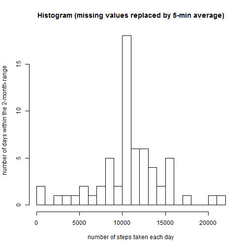

# Reproducible Research: Peer Assessment 1


## Loading and preprocessing the data

First, we set the working directory where the extracted csv-file was placed. This file is loaded into the object "raw"


```r
setwd("D:/Documents/R/DataScience/git/RepData_PeerAssessment1")
raw <- read.csv("activity.csv")
```

Second, the column containing the dates is formated as such for later recognition of weekdays


```r
tidy <- raw
tidy$date <- as.Date(raw$date, format = "%Y-%m-%d")
```


## What is mean total number of steps taken per day?

Here is a histogram of the total number of steps taken each day:


```r
library(plyr)
steps.day <- ddply(tidy, .(date), summarize, sum=sum(steps))
hist(steps.day$sum, breaks = 20, xlab = "number of steps taken each day", ylab = "number of days within the 2-month-range", main = "Histogram (ignoring missing values)")
```

 

Here is the mean and median of the total number of steps taken per day:


```r
steps.day.mean <- mean(steps.day$sum, na.rm = TRUE)
steps.day.median <- median(steps.day$sum, na.rm = TRUE)
```

The total number of steps taken per day has a mean of 1.0766 &times; 10<sup>4</sup> and a median of 10765.


## What is the average daily activity pattern?

The daily activity pattern averages across all days; for the time series plot, missing values have to be treated, here simply ignored.


```r
steps.interval <- ddply(tidy, .(interval), summarize, average=mean(steps, na.rm=TRUE))
plot(steps.interval, type = 'l', xlab = "Interval", ylab = "Average number of steps")
```

 

```r
max.int <- steps.interval$interval[steps.interval$average==max(steps.interval$average)]
```

The 5-minute interval 835 contains the maximum number of steps.


## Imputing missing values


```r
missing <- sum(is.na(tidy$steps))
```

There are 2304 missing values, i.e. number of rows with NAs, in the dataset.

A new dataset is created, named tidy2, with missing date replaced by the mean for that 5-min interval.


```r
tidy2 <- tidy
for (i in 1:dim(tidy)[1]) {
  if (is.na(tidy2[i,1])==TRUE) {
    tidy2[i,1] <- steps.interval$average[steps.interval$interval==tidy2[i,3]]
  }
}
```

Repeat the previous step done on tidy with tidy2: 

Here is a histogram of the total number of steps taken each day (missing values replaced by mean for that 5-min interval)


```r
library(plyr)
steps.day2 <- ddply(tidy2, .(date), summarize, sum=sum(steps))
hist(steps.day2$sum, breaks = 20, xlab = "number of steps taken each day", ylab = "number of days within the 2-month-range", main = "Histogram (missing values replaced by 5-min average)")
```

 

Here is the mean and median total number of steps taken per day (missing values replaced by mean for that 5-min interval)


```r
steps.day.mean2 <- mean(steps.day2$sum, na.rm = TRUE)
steps.day.median2 <- median(steps.day2$sum, na.rm = TRUE)
```

The total number of steps taken per day has a mean of 1.0766 &times; 10<sup>4</sup> and a median of 1.0766 &times; 10<sup>4</sup>.

The NA's affected only eight days, but those entirely (8 time 288 equals the total of 2304 missing values). Therefore, the mean over a day was not useful to replace the NA's. Consequently, only those 8 days were affected, and all of them received identical values, i.e. for each of the 288 5-min intervals the average of the 53 valid days.  
In the histogram, the middle bar grew by 8 (from 10 to 18).
The mean is exactly the same as before imputing missing values, as the mean was used to replace the previous NAs.
The median is now equal to the mean, not being an integer number any more, as there are now 8 days with this mean number of steps per day.


## Are there differences in activity patterns between weekdays and weekends?

A new factor variable is created in the dataset with two levels - "weekday" and "weekend" indicating whether a given date is a weekday day or weekend day.


```r
tidy2$wd.type <- weekdays(tidy2$date)
tidy2$wd.type <- gsub("Montag", "weekday", tidy2$wd.type)
tidy2$wd.type <- gsub("Dienstag", "weekday", tidy2$wd.type)
tidy2$wd.type <- gsub("Mittwoch", "weekday", tidy2$wd.type)
tidy2$wd.type <- gsub("Donnerstag", "weekday", tidy2$wd.type)
tidy2$wd.type <- gsub("Freitag", "weekday", tidy2$wd.type)
tidy2$wd.type <- gsub("Samstag", "weekend", tidy2$wd.type)
tidy2$wd.type <- gsub("Sonntag", "weekend", tidy2$wd.type)
tidy2$wd.type <- as.factor(tidy2$wd.type)
```

The daily activity pattern averages across all days, separating between weekday days and weekend days. 


```r
steps.interval.wd <- ddply(tidy2, .(interval, wd.type), summarize, average=mean(steps))
library(lattice)
xyplot(average ~ interval | wd.type, data = steps.interval.wd, layout = c(1,2), type = 'l', xlab = "Interval", ylab = "Average number of steps")
```

 

